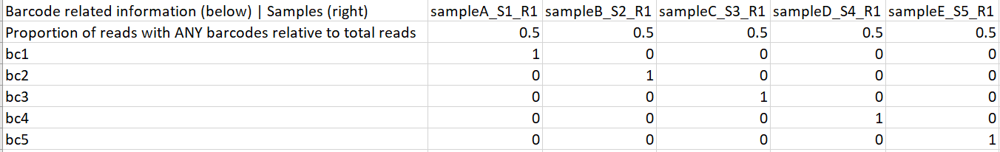

# A *wrapper* script for NGS Bar-seq analysis

## Introduction

The approach presented herein was developed at CGEBM to support barcode analysis by sequencing (Bar-seq) \[[1][1]\] studies. It consists of a pair of scripts — a *dispatcher* bash code and a Perl *wrapper* over the open-source BBDuk tool (BBMap suite version 35.43 \[[2][2]\]) &mdash; designed to quantify the total number of reads for each barcode and its abundance relative to the total number of the barcode reads. If you find any of the scripts or concepts presented here useful for your research, **please cite**:

Pradhan A, Herrero-de-Dios C, Belmonte R, Budge S, Lopez Garcia A, Kolmogorova A, et al. (2017) Elevated catalase expression in a fungal pathogen is a double-edged sword of iron. PLoS Pathog 13(5): e1006405. https://doi.org/10.1371/journal.ppat.1006405

## Overview of the solution

In order to analyse the Bar-seq data, the solution visits each sample directory and runs the 3rd-party *bbduk.sh* script \[[2][2]\] over the targeted compressed read FASTQ file generating corresponding FASTQ intermediate files for the "matched" and "not-matched" reads per barcode. The *wrapper* then computes the total number of reads for each barcode and its abundance relative to the total number of the barcode reads, generating a tabulated report for that particular sample.

## Running scripts

No installation is required. The scripts run on the command line as described further below.

Users can make scripts executable by running:

```
chmod +x barcodeDetectionCodeDispatcher.sh
./barcodeDetectionCodeDispatcher.sh

chmod +x generalBBDUK4BarSeq.pl
```

## Usage example

Let's suppose a scenario in which we would like to check for the presence of 5 distinct barcode sequences of 25 nucleotides each across 5 different samples. Typically, after sequencing, these samples will be represented by their related subfolders (e.g. 'sampleA', 'sampleB', 'sampleC', 'sampleD', and 'sampleE') in a primary parent folder (e.g. 'samples_folder'; Figure 1). The actual read dataset(s) will be located in each associated subfolder.

```
|
├── samples_folder
│   ├── sampleA
│   │   ├── sampleA_S1_L001_R1_001.fastq.gz
│   │   └── sampleA_S1_L001_R2_001.fastq.gz
│   ├── sampleB
│   │   ├── sampleB_S2_L001_R1_001.fastq.gz
│   │   └── sampleB_S2_L001_R2_001.fastq.gz
│   ├── sampleC
│   │   ├── sampleC_S3_L001_R1_001.fastq.gz
│   │   └── sampleC_S3_L001_R2_001.fastq.gz
│   ├── sampleD
│   │   ├── sampleD_S4_L001_R1_001.fastq.gz
│   │   └── sampleD_S4_L001_R2_001.fastq.gz
│   └── sampleE
│       ├── sampleE_S5_L001_R1_001.fastq.gz
│       └── sampleE_S5_L001_R2_001.fastq.gz
```

  **Figure 1** File system snapshot of the example scenario.

Barcodes are very short sequences (usually 20-30 nucleotides in length). As one of the inputs for the solution, we first need to create a *barcodes.fasta* file representing the list of unique short sequences we would like to search across the reads of our study (Figure 2).

```
>bc1
TACAATTTTGGGCAGGTGCAACCAT
>bc2
TGACCAAGCCTTTTTAGCGTCATAA
>bc3
ACGAAGCGTGTTTCGTATCGAACGC
>bc4
TTAATTGCTTTCAGCCACCGTGAAA
>bc5
TTTAAGCATACTTTTATCCGTGCGC
```

**Figure 2** *barcodes.fasta* file example.

Once we have the scripts installed in our desired file system structure, we must navigate to the parent folder containing the samples subfolders and run the *dispatcher* component from there, with the following usage syntax:

```
$ ./barcodeDetectionCodeDispatcher.sh <absolute path to the base directory that contains the samples subfolders (as when obtained via pwd command; i.e. without trailing slashes)> <mismatch rate allowed when looking for the barcode sequence (options: 0 to 3)> <absolute path to the list of barcodes FASTA file> <INT value representing the time (in hours) that should be allocated for each job to run> <R1 or R2 read type to be analysed (options: 1 for R1 reads or 2 for R2 reads)>
```

So, in our example, this could be translated to:

```
[myUser@myMachine samples_folder]$ ~/CGEBM/BarSeq/barcodeDetectionCodeDispatcher.sh /myInstitution/home/users/myUser/scratchArea/samples_folder 0 /myInstitution/home/users/myUser/scratchArea/barcodes.fasta 2 1
```

where:

* ``[myUser@myMachine samples_folder]$`` denotes that the script will be executed from the ``samples_folder`` directory;

* ``~/CGEBM/BarSeq/barcodeDetectionCodeDispatcher.sh`` represents the shortcut to the *dispatcher* script in the particular environment of ``myUser``;
* ``/myInstitution/home/users/myUser/scratchArea/samples_folder`` is the absolute path to the parent folder of the samples subfolders<sup>[1](#myfootnote1)</sup>;
* ``0`` means that no mismatches are allowed when looking for the barcode sequence<sup>[2](#myfootnote2)</sup>;
* ``/myInstitution/home/users/myUser/scratchArea/barcodes.fasta`` is the absolute path to the list of barcodes FASTA file;
* ``2`` means that 2 hours would be allocated for each barcode search job execution<sup>[3](#myfootnote3)</sup>;
* ``1`` means that only forward reads ("R1") of each sample will be processed in this particular run<sup>[4](#myfootnote4)</sup>;

After running the scripts, we should find the associated tabulated text file report generated for each sample (e.g. 'sampleA_S1_R1_report.txt', 'sampleB_S2_R1_report.txt', 'sampleC_S3_R1_report.txt', 'sampleD_S4_R1_report.txt', and 'sampleE_S5_R1_report.txt')<sup>[5](#myfootnote5)</sup> . Such reports may then be merged onto a final tabulated one by using the following approach, for instance:

```
[myUser@myMachine samples_folder]$ ls */*R1_report.txt | sort -V | xargs paste > samples_folder_R1_rawReport.txt

[myUser@myMachine samples_folder]$ cut -f 1,2,4,6,8,10 samples_folder_R1_rawReport.txt > samples_folder_R1_finalReport.txt

[myUser@myMachine samples_folder]$ more samples_folder_R1_finalReport.txt
Barcode related information (below) | Samples (right)   sampleA_S1_R1   sampleB_S2_R1   sampleC_S3_R1   sampleD_S4_R1   sampleE_S5_R1
Proportion of reads with ANY barcodes relative to total reads   0.5     0.5     0.5     0.5     0.5
bc1     1       0       0       0       0
bc2     0       1       0       0       0
bc3     0       0       1       0       0
bc4     0       0       0       1       0
bc5     0       0       0       0       1
```

In this example scenario with 5 generated reports, the first suggested operation merges all of them onto a "raw" version one. Then, by *cutting* the latter's first field as well as the subsequent even ones (up to the 10<sup>th</sup>,  in this case), we can redirect the output to a more tidy tabulated version. This version keeps the left-most column (listing the barcode identifiers, for instance) as well as the ones with the information retrieved for each of the samples, as presented by the *more* command above. This tabulated report file can then be further analysed using tools like Excel or R. Figure 3 shows our example's final report format in a spreadsheet-like interface.



**Figure 3** Example's final report visualisation in a spreadsheet-like interface.

The report reveals that, in our example scenario, each sample presents barcodes in only half (50%) of the total number of respective reads. In sampleA, for instance, such a proportion is fully represented (100%) by reads with barcode 'bc1'. In sampleB, 100% of the reads with any barcode only contain barcode 'bc2'. For sampleC, barcode 'bc3' is present in 100% of the reads with any barcode and so forth.

## Test environment / requirements

* Linux CentOS 7 3.10.0-957.27.2.el7.x86_64 kernel);
* GNU bash, version 4.2.46(2)-release (x86_64-redhat-linux-gnu);
* OpenJDK-8.0.152;
* Perl 5, version 16, subversion 3 (v5.16.3) built for x86_64-linux-thread-multi (with 39 registered patches);
* BBDuk tool (part of BBMap suite version 35.43).

## Additional recommendations

* This version of the code does not implement any sort of semaphore or lock mechanism towards the access of the read files during runtime. Thus, it is not recommended to execute multiple *dispatcher* runs simultaneously aiming to explore the same type of read dataset (e.g. "R1") within the same parent folder. For instance, based on our example scenario, it is not recommended to fire up two simultaneous *dispatcher* jobs, from the 'samples_folder' directory, looking for barcodes in the "R1" reads. This may generate unpredictable results. It is possible, though, to run two simultaneous *dispatcher* jobs if needed, one for the "R1" reads and the other for "R2" datasets;
*  The code also expects that all barcode sequences are UNIQUE within a particular run, i.e. no barcode sequence duplicates should be present in the input FASTA, even if they have distinct identifiers/headers. Additionally, if any barcode sequence is detected within the length of a sequencing read, the code expects it to happen only once per read;
* All efforts have been made to ensure maximum accuracy of the code presented here. However, if you face any issues, please open a new issue thread here and we will try to make patches as quickly as possible. For general feedback (not errors or bugs), please contact <antonio.ribeiro@abdn.ac.uk>.

## Acknowledgements

Author: [Antonio Claudio Bello Ribeiro](https://github.com/acbellorib);

Institution: [Centre for Genome-Enabled Biology and Medicine](https://www.abdn.ac.uk/genomics/), University of Aberdeen;

The author would like to acknowledge the support of the Maxwell Compute Cluster funded by the University of Aberdeen.

Copyright (C) 2015-present Antonio Claudio Bello Ribeiro and contributors

License GPLv3+: GNU GPL version 3 or later <http://gnu.org/licenses/gpl.html>

This program comes with ABSOLUTELY NO WARRANTY. It is free software and you are welcome to redistribute it under certain conditions.

## References

[1]: https://pubmed.ncbi.nlm.nih.gov/19622793/ "Smith A. M., Heisler L. E., Mellor J., Kaper F., Thompson M. J., et al. , 2009. Quantitative phenotyping via deep barcode sequencing. Genome Res. 19: 1836–1842. DOI: 10.1101/gr.093955.109"

\[1\] Smith A. M., Heisler L. E., Mellor J., Kaper F., Thompson M. J., et al. , 2009. Quantitative phenotyping via deep barcode sequencing. Genome Res. 19: 1836–1842. DOI: 10.1101/gr.093955.109

[2]: https://sourceforge.net/projects/bbmap/ "Bushnell, B. BBMap (Version 35.43). 2015."

\[2\] https://sourceforge.net/projects/bbmap/ Bushnell, B. BBMap (Version 35.43). 2015.

### Footnotes
<a name="myfootnote1">1</a>: In the current version of the code, the parent folder information is provided as an argument just for internal usage. The user must navigate to the parent folder and fire up the *dispatcher* script from there so it can run appropriately. For the sake of precision, this version also expects that the user provides ABSOLUTE paths to both the parent folder and the FASTA file with the list of barcodes. Special notations to represent relative positions in the file system, as "." (dot) and ".." (dot dot), are not allowed.

<a name="myfootnote2">2</a>: The 1-3 mismatch rates range was initially implemented for testing and debugging purposes. Since a zero mismatch rate ensures that only perfect matches to each specific barcode are detected and included in abundance calculations, its application is preferable.

<a name="myfootnote3">3</a>: This solution has been conceived and tested using High-Performance Computing (HPC) scheduling systems. For this reason, the time allocation parameter has been kept here. Other users might want or need to adapt the code for their particular environments. Other options are suggested directly in the code.

<a name="myfootnote4">4</a>: This solution has also been conceived and tested to work with either single or paired-end reads generated by Illumina sequencing technology (Illumina, San Diego, CA). Reverse reads ("R2") were mainly used for testing and debugging purposes when prototyping this code. Our experience with Bar-seq experiments has shown that reverse reads typically generate redundant results. Hence, the usage of forward reads should suffice.

<a name="myfootnote5">5</a>: For this solution, the creation of parallel reports proved to be a more efficient way of using the HPC environment when compared, for instance, to the possible alternative option of processing each sample subfolder at a time.

Page updated: 09/11/2020
